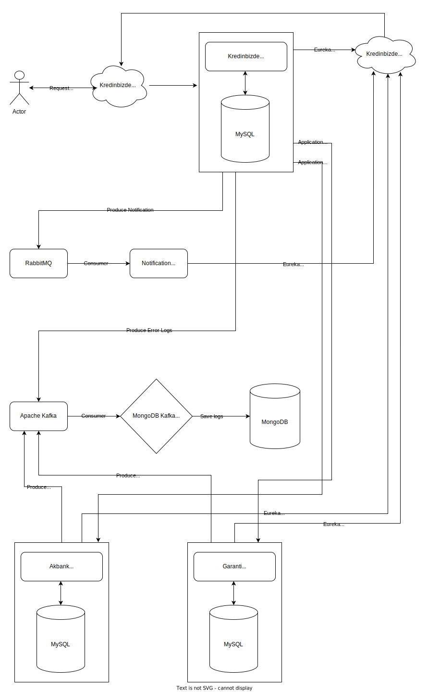
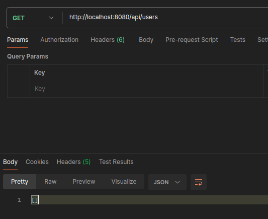
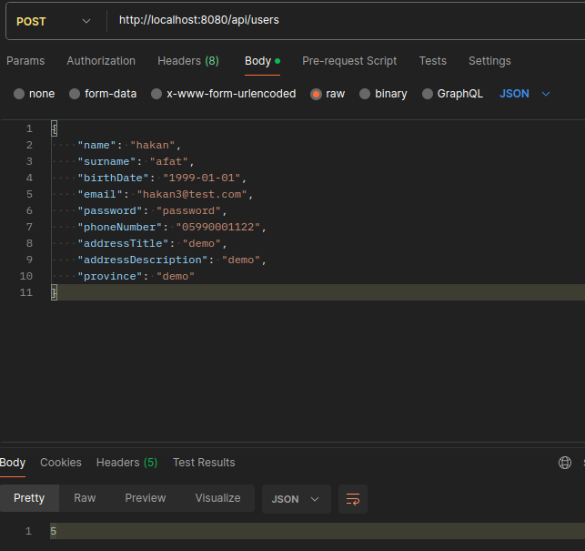
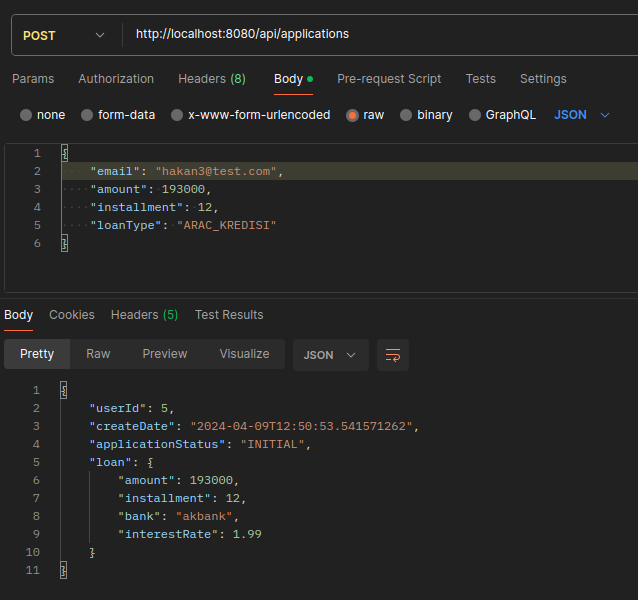
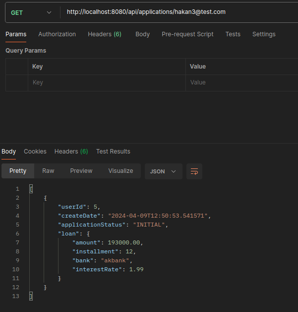
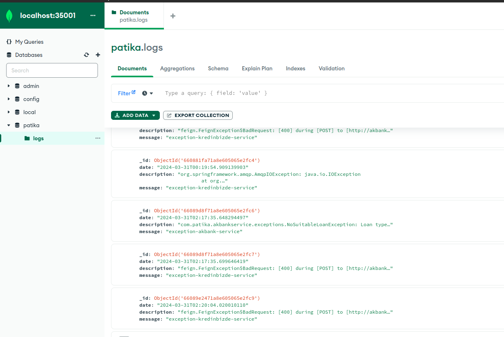
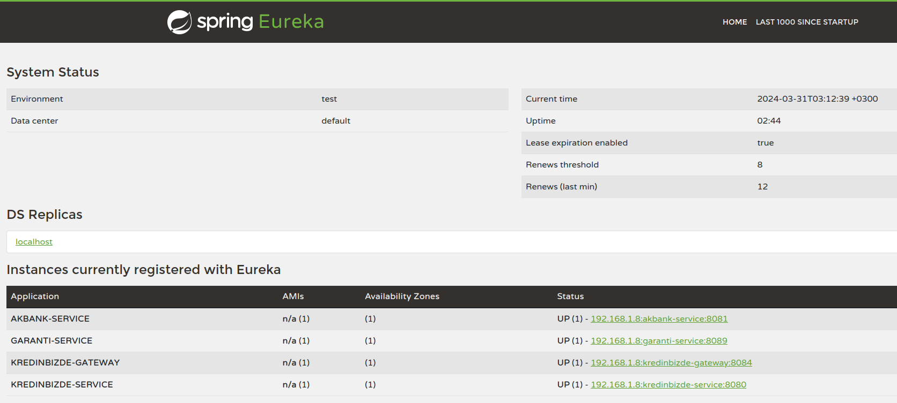

# KredinBizde Services

Here is the general schematic for our system's architecture.

# Installation

Firstly, We need to go `cd kafka/mongodb-kafka-base` then open a terminal and run `docker-compose -p mongo-kafka up`. 
This will creates needed mongodb kafka setup for us. 
Then, We need to enable sink connector for log collection from kafka to mongodb. Open a terminal then run `docker exec -it mongo1 /bin/bash`. 
We need to copy sink connector from `kafka/mongodb-kafka-base/simplesink.json` via use nano like `nano simplesink.json` and save the file.
Then, We can configure with existing tool on image `cx simplesink.json`. Our configuration is done.

Secondly, We need to run a rabbitmq image, open a terminal and run `docker run -it --rm --name rabbitmq -p 5672:5672 -p 15672:15672 -e RABBITMQ_DEFAULT_USER=admin -e RABBITMQ_DEFAULT_PASS=123456 rabbitmq:3.13-management`

We need mysql for our application. For simple testing, we can use single mysql container. But in production, we can seperate database containers and kafka log collection.
Open a terminal and run `docker run -d --name some-mysql -p 3306:3306 -p -e MYSQL_ROOT_PASSWORD=password mysql`.

We need to configure database for one time. Open another terminal and run `docker exec -it some-mysql /bin/bash`. 
Enter `mysql -uroot -p -A` command and enter password. 
Then we need to run commands at `initial_db.sql`.

Initial setup is complete. We can start all services and use via gateway `localhost:8084` or directly to `localhost:8080`.

## Banks
Each bank has own service, including creating new loan and listing the loans endpoints. Also each bank has own application repository.

## Kredinbizde
This service can create user, list user and has user repository. But when user needs to check their applications or create new application, connects to each bank that registered on service, fetchs applications or creates applications over client.

## Logs
We can collect all logs via Kafka then saved to the MongoDB.

## Notifications
We have a basic notification service that consumes the queue on the RabbitMQ. 

## Screenshots

### Check users

### Create new user

### Create new loan application

### Get applications of a user

### Logs on MongoDB

### Eureka Discovery
